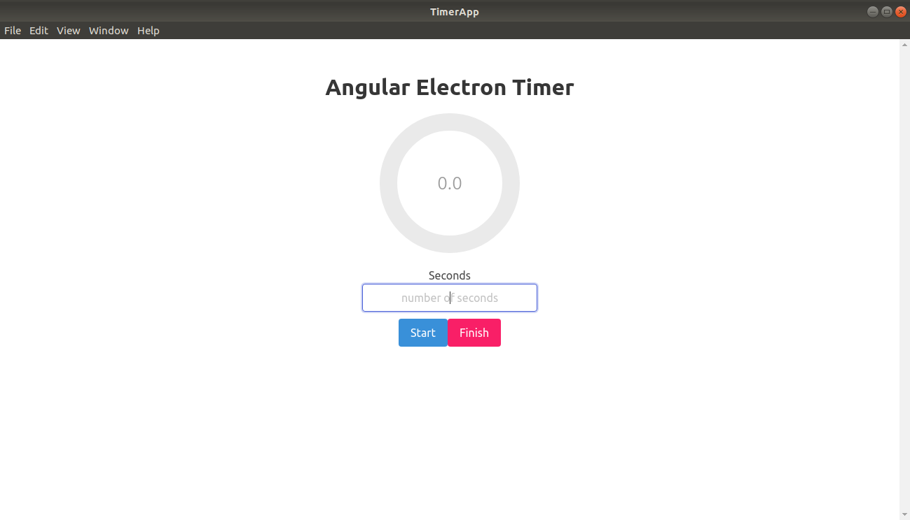

# PROJECT NAME. :arrow_forward::high_brightness:
The project is titled 'Timer-App'. For more information check [this](https://medium.com/@successam336/combining-angular-and-electron-timer-application-e7ba88d5cc9f) out.

## DESCRIPTION OF PROJECT.
The project is a simple desktop application that serves as a timer:medal_military::medal_military::trophy:
 

   

### PROJECT SETUP INSTRUCTIONS.
1. Fork this repository.
2. Clone this repository onto your local machine through use of the command `git clone <Forked-repository-link.>`. 
3. Navigate to your terminal.
4. Navigate the the appropriate directory by use of cd command `cd<root-folder>`.
5. In order to make any additional changes to the project, it is highly advised that you install an appropriate IDE or code editor(Integrated Development Environment).
6. Run the command `npm install`.
7. Run the command `npm start` to start the app.

### KNOWN BUGS.:warning::warning:
----------------------------------------

### CONTACT INFORMATION.
For more information, feel free to contact me through the email address: mootassame@gmail.com

